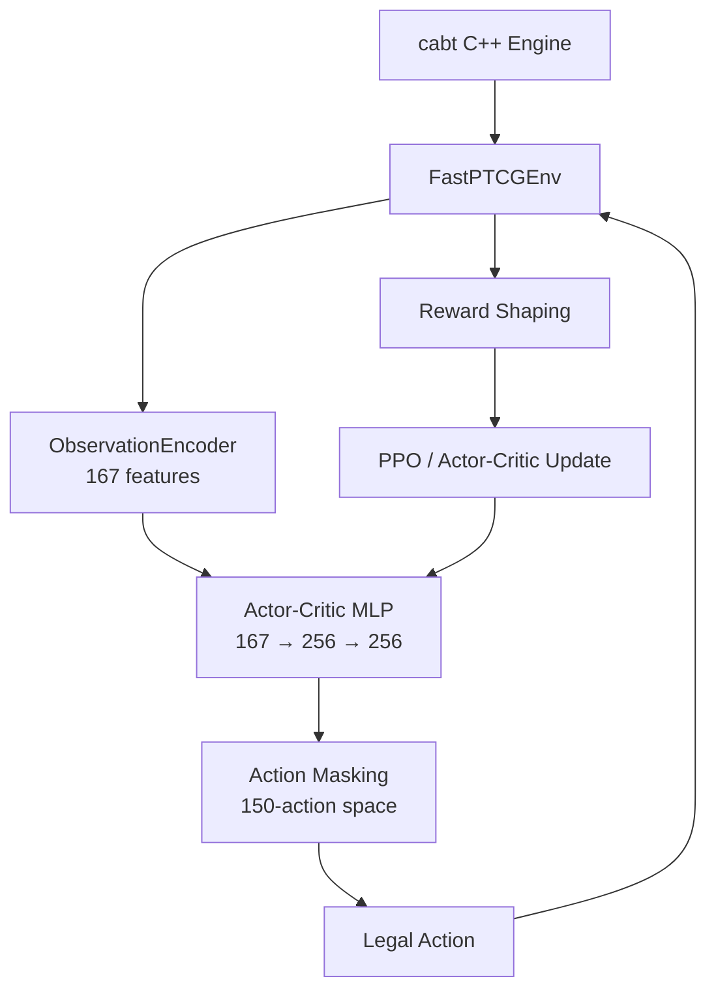

<h1 align="center">PTCG AI Battle Agent</h1>

<p align="center">
  <strong>End-to-end Pokémon TCG game-playing agent combining simulation, reinforcement learning, heuristic planning, replay analysis, and evolutionary policy tuning.</strong>
</p>

<p align="center">
  
</p>

<p align="center">
  <a href="https://www.kaggle.com/competitions/pokemon-tcg-ai-battle"></a>
  <a href="https://matsuoinstitute.github.io/cabt/"></a>
  <a href="https://pytorch.org/"></a>
  <a href="https://gymnasium.farama.org/"></a>
</p>

<p align="center">
  
  
  
  
</p>

---

## Overview

This repository contains an experimental AI agent for the **Kaggle Pokémon TCG AI Battle Challenge**.

The project began as a reinforcement-learning system and evolved into a broader game-playing framework after benchmarking multiple approaches against the real competition ladder. It combines **domain-specific heuristics, replay-driven debugging, neural policies, search experiments, and automated policy tuning**, all backed by a custom simulation environment.

<div align="center">
  
  
  
  
</div>

### Current Result

**958.8** is the best recorded ladder score from **Mega Lucario v19**.

The best RL/PPO submission reached **342.0**, which became the turning point for the project. Instead of forcing a neural policy to learn every tactical interaction from scratch, the project pivoted toward domain-aware planning and replay-driven optimization.

> **Build the simulator → test an idea → measure it → inspect failures → turn failures into better decisions.**

---

## What the System Does

The agent converts a live Pokémon TCG game state into a legal, strategically ranked action.

```text
                    ┌──────────────────────┐
                    │   Pokémon TCG Game   │
                    │      cabt Engine     │
                    └──────────┬───────────┘
                               │ Observation
                               ▼
                    ┌──────────────────────┐
                    │ State / Context      │
                    │ Encoding & Tracking  │
                    └──────────┬───────────┘
                               │
                               ▼
        ┌──────────────────────────────────────────┐
        │              Decision Layer              │
        │                                          │
        │   PPO / Neural Policy    Heuristic AI    │
        │   Transformer / MCTS     Replay Rules    │
        └────────────────────┬─────────────────────┘
                             │ Candidate actions
                             ▼
                    ┌──────────────────┐
                    │ Action Masking   │
                    │ + Safety Checks  │
                    └────────┬─────────┘
                             │ Legal action
                             ▼
                    ┌──────────────────┐
                    │   cabt Engine    │
                    └────────┬─────────┘
                             │
                             ▼
                         New State
                             │
                             └──────────────► Replay / Evaluation
                                                   │
                                                   ▼
                                            Policy Improvement
```

The architecture is modular: simulation, state representation, policy logic, action validation, training, evaluation, and replay analysis can evolve independently.

---

## Architecture

### 1. Game Simulation Layer

The project uses the **cabt C++ Pokémon TCG engine** as its game simulator. `FastPTCGEnv` wraps the engine with a Gymnasium-compatible interface.

<div align="right">
  
</div>

```text
Agent action
     │
     ▼
FastPTCGEnv
     │
     ▼
cabt C++ engine
     │
     ├── game state
     ├── legal selections
     ├── game result
     └── opponent turn
             │
             ▼
      opponent policy
             │
             └── repeat until agent's turn
```

The environment fast-forwards opponent turns so learning focuses on decisions controlled by the agent.

**Key file:** `src/env/fast_sim.py`

<br clear="right"/>

### 2. State Representation

The raw engine observation is a nested, variable-length game-state structure. `ObservationEncoder` converts it into a numerical representation for neural policies.

The current PPO training pipeline uses a **167-dimensional state representation** covering information such as:

- Active and benched Pokémon
- HP and maximum HP
- Attached energy
- Hand, deck and discard information
- Prize state
- Turn and step context
- Visible opponent state
- Current selection context

**Key files:** `src/agent/state_encoder.py`, `src/agent/opponent_model.py`

<div align="center">
  
</div>

### 3. Legal-Action Masking

Pokémon TCG has a large, context-dependent action space. The same action can be legal in one state and invalid in another.

```text
Raw policy logits
       │
       ▼
┌──────────────────┐
│ Legal action mask│
│ 1 = legal        │
│ 0 = illegal      │
└────────┬─────────┘
         ▼
    Masked logits
         │
         ▼
    Selected action
```

Masking is critical for competition stability because invalid engine actions can terminate a submission.

**Key file:** `src/agent/action_mask.py`

---

## Reinforcement Learning Pipeline

One major branch of the project explored PPO-based learning from simulated games.



### Parallel Training

The parallel trainer uses multiple independent environments and batches observations for neural-network inference. The Phase 3 pipeline was designed for long-running runs of hundreds of thousands of episodes.

**Key file:** `src/train/train_ppo_parallel.py`

### Reward Shaping

Rewards combine terminal outcomes with intermediate game-state signals:

- `+1.0` for a win
- `-1.0` for a loss
- Small draw penalty
- Positive reward for taking Prize cards
- Negative reward when the opponent takes Prizes
- Board utility based on HP and energy
- Deck-preservation pressure
- Bench-out and deck-out signals

**Key file:** `src/env/reward.py`

<div align="center">
  
</div>

---

## Heuristic Planning: Mega Lucario

The strongest agent in the repository is currently the **Mega Lucario rule-based policy**.

Instead of asking a neural network to learn every tactical interaction from scratch, the policy explicitly scores actions using game-state and card-context features.

```text
                    Current Game State
                           │
                           ▼
                  Generate legal actions
                           │
                           ▼
              ┌─────────────────────────┐
              │ Action scoring function │
              │                         │
              │ Pokémon setup           │
              │ Evolution               │
              │ Abilities               │
              │ Energy attachment       │
              │ Trainer usage           │
              │ Switching               │
              │ Boss's Orders           │
              │ Attacks                 │
              │ Deck / prize context    │
              └────────────┬────────────┘
                           │
                           ▼
                    Ranked legal actions
                           │
                           ▼
                       Best action
```

The policy contains specialized logic for setup, evolution, energy management, attacks, switching, Boss's Orders, Hero Cape, deck preservation, and bench management.

<div align="center">
  
</div>

**Key file:** `src/agent/rule_based_lucario.py`

---

## Replay-Driven Improvement

Real Kaggle games are treated as debugging data rather than merely as a final score.

```text
Kaggle Submission
       │
       ▼
   Real Matches
       │
       ▼
     Replays
       │
       ▼
Replay Parsing / Analysis
       │
       ▼
Identify repeated misplays
       │
       ▼
Patch decision logic
       │
       ▼
New submission
       │
       └──────────────► Ladder score
                              │
                              └──► repeat
```

Replay analysis was used to identify tactical failures including attack timing, Boss's Orders target selection, Hero Cape usage, prize-trail decisions, and deck-search behavior.

**Key files:**

- `src/train/download_replays.py`
- `src/train/parse_replays.py`
- `src/train/analyze_replays.py`
- `src/train/analyze_replays_v2.py`
- `src/train/replay_debugger.py`

---

## Evolutionary Policy Tuning

The heuristic policy exposes action-priority weights that can be mutated and evaluated automatically.

```text
Initial policy weights
        │
        ▼
     Mutation
        │
        ▼
  Run evaluation
        │
        ▼
Keep / reject candidate
        │
        └──────────► repeat
```

This creates a lightweight black-box optimization layer around the hand-engineered decision function.

**Key files:** `src/agent/lucario_w.json`, `src/train/evolve_lucario.py`

---

## Hybrid & Search Experiments

The repository also contains experiments beyond vanilla PPO and hand-written heuristics, including Transformer-based policy representations and MCTS-style search.

```text
Structured game state
        │
        ▼
Card / state embeddings
        │
        ▼
Transformer encoder
        │
        ├──────────────► Value estimate
        │
        ▼
Action / decoder representation
        │
        ▼
Policy scores
        │
        ▼
Search / action selection
```

These experiments form the research path toward combining learned representations with domain-specific planning.

**Key file:** `src/agent/hybrid_lucario.py`

---

## Competition Results

The project uses a phase-gated workflow: new strategies are promoted only after empirical testing against the real competition environment.

| Stage | Result | Outcome |
|---|---:|---|
| Initial rule-based baseline | **170.1** | Working baseline |
| RL / PPO pipeline | **303.6** | Major improvement over baseline |
| Best RL submission | **342.0** | RL plateau / pivot point |
| Mega Lucario heuristic | **615.4** | Domain specialization |
| Improved Lucario policy | **775.5** | Better tactical decisions |
| Replay-patched policy | **902.4** | Major tactical improvements |
| Replay-patched peak | **936.0** | Best score during that iteration |
| **Lucario v19** | **958.8** | **Current best recorded score** |
| Lucario v20 | Pending | Deck-search / low-deck hotfix |

See [`eval/ladder_log.md`](eval/ladder_log.md) for the complete experiment history.

---

## Why RL Was Not the Final Winner

The project is intentionally not presented as “more neural network = better agent.”

The competition environment rewards **precise tactical execution, legal-action reliability, and deck-specific planning**. PPO reached 342.0, while the carefully engineered Mega Lucario policy reached 958.8.

That comparison led to the current architecture:

```text
RL / Neural methods
       │
       ├── representation learning
       ├── policy experiments
       └── future generalization

Domain heuristics
       │
       ├── tactical priors
       ├── predictable behavior
       └── easy debugging

Replay analysis
       │
       └── converts failures into targeted fixes

Evolutionary tuning
       │
       └── searches the heuristic parameter space

              ↓

        Strong competition agent
```

The result is an empirical decision-making system built around the constraints of the actual game and deployment environment.

---

## Project Structure

```text
ptcg-rl-agent/
├── main.py                         # Competition entrypoint
├── deck.csv                        # Active competition deck
├── requirements.txt
│
├── src/
│   ├── agent/
│   │   ├── action_mask.py          # Legal-action masking
│   │   ├── state_encoder.py        # Observation → vector encoding
│   │   ├── opponent_model.py       # Opponent-state tracking
│   │   ├── policy.py               # NumPy neural-policy inference
│   │   ├── rule_based_lucario.py   # Mega Lucario heuristic
│   │   └── hybrid_lucario.py       # Transformer / hybrid experiments
│   │
│   ├── env/
│   │   ├── fast_sim.py             # Gymnasium + cabt wrapper
│   │   └── reward.py               # Reward shaping
│   │
│   └── train/
│       ├── train_ppo.py            # PPO training
│       ├── train_ppo_parallel.py   # Parallel PPO training
│       ├── parse_replays.py        # Replay processing
│       ├── analyze_replays.py      # Replay analysis
│       ├── replay_debugger.py      # Tactical debugging
│       └── evolve_lucario.py       # Policy optimization
│
├── eval/
│   └── ladder_log.md               # Submission / ladder history
├── tests/                          # Tests
├── decks/                          # Deck analysis
└── models/                         # Model artifacts
```

---

## Deployment Pipeline

Training and competition inference are separated.

```text
LOCAL DEVELOPMENT

cabt simulator
      │
      ▼
PyTorch / RL training
      │
      ├── checkpoints
      └── NumPy weight export

              ↓

KAGGLE DEPLOYMENT

main.py
   │
   ├── deck.csv
   ├── heuristic policy
   └── optional NumPy neural policy
             │
             ▼
        cabt engine
             │
             ▼
        Legal action
```

For neural inference, PyTorch weights can be exported to `.npz` and evaluated using NumPy, keeping the competition runtime lightweight.

---

## Local Setup

```bash
python -m venv .venv

# Windows
.venv\\Scripts\\activate

# Linux / macOS
source .venv/bin/activate

pip install -r requirements.txt
```

### Train PPO

```bash
python src/train/train_ppo.py
```

### Parallel Training

```bash
python src/train/train_ppo_parallel.py
```

### Run Tests

```bash
pytest
```

> Exact competition packaging and engine setup depend on the Kaggle environment and supplied competition files. See the repository's training scripts and `AGENTS.md` for environment-specific details.

---

## Lessons From the Experiment

### 1. More complex RL does not guarantee a better game agent

The strongest RL result plateaued far below the strongest domain-specific policy.

### 2. Action legality is part of intelligence

A theoretically strong policy is useless if it repeatedly emits invalid actions or crashes the engine.

### 3. Replays are valuable training data even without supervised learning

A replay can reveal *why* an agent made a bad decision and point directly to a missing rule or feature.

### 4. Domain knowledge reduces the search space

Mega Lucario does not need to rediscover every obvious Pokémon TCG interaction through millions of games.

### 5. Evaluation should drive architecture decisions

The project moved from PPO → hybrid experiments → heuristic planning because the measured competition results demanded it.

---

## Future Work

- Implement canonical clipped PPO with proper rollout buffers and multi-step advantage estimation.
- Combine learned policy scores with heuristic tactical priors.
- Add MCTS over the strongest heuristic policy.
- Improve entity-aware card/state embeddings with attention.
- Train against a broader opponent population and multiple decks.
- Build reproducible local evaluation with confidence intervals.
- Convert known tactical mistakes into automated replay regression tests.
- Push the Mega Lucario policy beyond the current **958.8** benchmark.

---

## References

- [cabt Engine Documentation](https://matsuoinstitute.github.io/cabt/)
- [Kaggle Pokémon TCG AI Battle](https://www.kaggle.com/competitions/pokemon-tcg-ai-battle)
- [Ladder Experiment Log](eval/ladder_log.md)
- [Agent Guidelines](AGENTS.md)
- [Deck Rationale](decks/deck_rationale.md)

---

## License

Competition-specific code and assets are subject to the applicable competition rules and terms. See the competition documentation before redistributing engine files, datasets, or submission artifacts.
