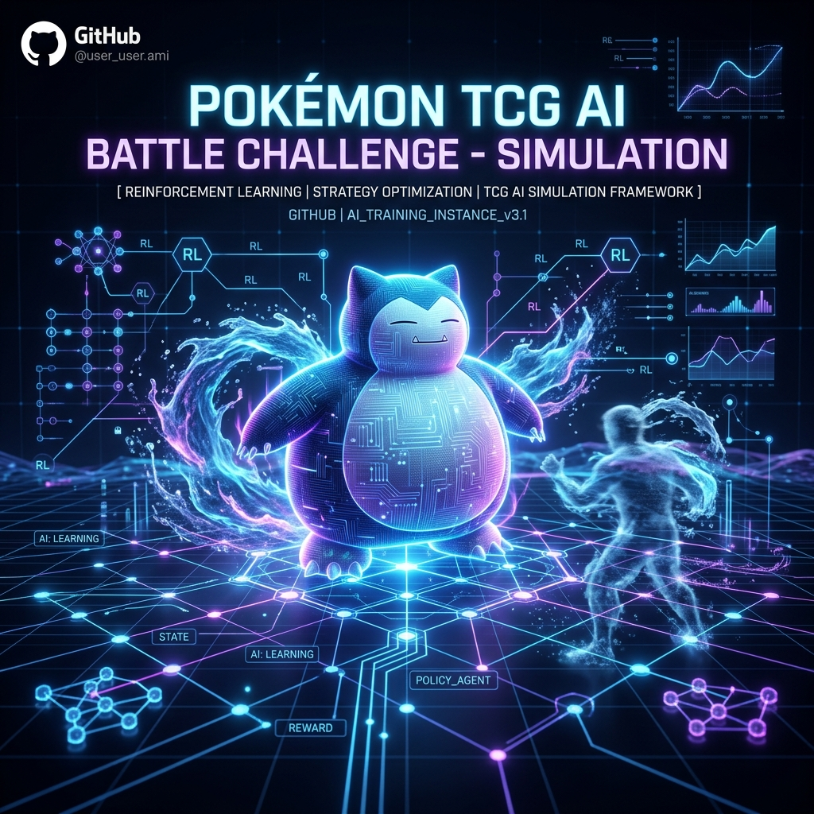

<p align="center">
  
</p>

<h1 align="center">🃏 PTCG AI Battle Agent</h1>

<p align="center">
  <strong>Reinforcement Learning + Heuristic Agent for the Kaggle Pokémon TCG AI Battle Challenge</strong>
</p>

<p align="center">
  <a href="https://www.kaggle.com/competitions/pokemon-tcg-ai-battle">
    
  </a>
  <a href="https://matsuoinstitute.github.io/cabt/">
    
  </a>
  <a href="https://pytorch.org/">
    
  </a>
  <a href="https://gymnasium.farama.org/">
    
  </a>
  
  
</p>

<p align="center">
  
  
  
  
  
</p>

---

## 📋 Overview

A competitive **PPO Reinforcement Learning** agent for the Kaggle Pokémon TCG AI Battle Challenge. The agent is trained locally using PyTorch + CUDA and deployed to Kaggle using a pure-NumPy inference pipeline for maximum compatibility.

The project follows a strict **phase-gated build order**: every new agent version must beat the previous real-ladder score before being promoted to production.

| Metric | Value |
|---|---|
| 🏆 Best Ladder Score | **303.6** (Phase 2 RL) |
| 📦 Submission Format | `submission.tar.gz` (main.py + deck.csv + src + models) |
| ⏱️ Time Budget | 600s per match |
| 🃏 Deck | Mono-Water Basic (60 cards) |
| 🧠 Policy | PPO Actor-Critic (MLP 24→128→128→150) |
| 🖥️ Training Hardware | AMD Ryzen 5 5600H + RTX 3050 (CUDA) |

---

## 🏗️ Project Structure

```
ptcg-rl-agent/
├── 📄 main.py                  # Thin Kaggle entrypoint (loads policy_agent)
├── 📄 deck.csv                 # 60-card deck submitted with the agent
├── 📁 src/
│   ├── 📁 agent/
│   │   ├── rule_based.py       # Phase 1: Heuristic rule-based agent
│   │   ├── policy.py           # Phase 2: Pure-NumPy RL policy inference
│   │   ├── state_encoder.py    # Encodes cabt JSON obs → flat float32 vector
│   │   ├── action_mask.py      # Masks illegal actions from logits (NumPy)
│   │   └── opponent_model.py   # Probabilistic opponent hand/deck tracker
│   ├── 📁 env/
│   │   ├── fast_sim.py         # Gymnasium wrapper around the C++ cg engine
│   │   └── reward.py           # Shaped reward (win/loss + prizes + KOs)
│   └── 📁 train/
│       ├── train_ppo.py        # PPO training loop (PyTorch + CUDA)
│       └── self_play.py        # Checkpoint pool for self-play training
├── 📁 models/
│   ├── ppo_baseline.pth        # PyTorch checkpoint (local training only)
│   └── ppo_weights.npz         # NumPy exported weights (Kaggle inference)
├── 📁 assets/
│   └── banner.png              # Project banner
├── 📁 decks/                   # Deck rationale documents
├── 📁 eval/
│   ├── ladder_log.md           # Real ladder submission log
│   └── local_vs_ladder.md      # Local sim vs. ladder comparison
└── 📁 scripts/                 # Build, validate, submit helpers
```

---

## ⚙️ Setup

### 1. Virtual Environment

```bash
python -m venv .venv
.venv\Scripts\activate        # Windows
pip install -r requirements.txt
```

### 2. Dataset

Authenticate with Kaggle (`~/.kaggle/kaggle.json`), then download the card dataset:

```bash
python -c "import kagglehub; kagglehub.competition_download('pokemon-tcg-ai-battle-challenge-strategy')"
```

Place `EN_Card_Data.csv` in the `data/` folder.

---

## 🚀 Usage

### Run a Local Test Match

```bash
.venv\Scripts\python tests\test_agent.py
```

Runs a full match between `policy_agent` (P0) and `rule_based_agent` (P1) using the local C++ sim.

### Train the PPO Model

```bash
.venv\Scripts\python src\train\train_ppo.py
```

Uses your RTX 3050 (CUDA). Saves weights to `models/ppo_baseline.pth` and `models/ppo_weights.npz`.

### Build & Submit to Kaggle

```bash
tar -czvf submission.tar.gz main.py deck.csv src models
kaggle competitions submit -c pokemon-tcg-ai-battle -f submission.tar.gz -m "your message"
```

> ⚠️ **Daily limit: 5 submissions.** Always run a local test match first.

---

## 📊 Phase Status & Ladder Results

| Phase | Status | Real Ladder Score | Notes |
|---|---|---|---|
| **Phase 0** — Deck Selection | ✅ Complete | — | Mono-Water: 4x Squirtle, 4x Staryu, 4x Poliwag, 48x Water Energy |
| **Phase 1** — Rule-Based Agent | ✅ Complete | **170.1** | Heuristic: Attack > Evolve > Play > Attach > End |
| **Phase 2** — RL Pipeline | ✅ Deployed | **303.6** 🏆 | PPO + Pure-NumPy inference. Current best. |
| **Phase 3** — At-Scale Self-Play | 🔄 Next | Target: **>303.6** | Parallel envs, self-play pool, competitive deck |

Full submission history → [`eval/ladder_log.md`](eval/ladder_log.md)

---

## 🧠 Phase 2 Architecture

### Key Design Decisions

> **Container fact**: The `cabt` environment is built `FROM gcr.io/kaggle-images/python:v163` —
> the full Kaggle Python image. **PyTorch IS available** at Kaggle runtime.
> Phase 2 crashes were Turn 0 deck-submission bugs, not missing imports.
> Phase 3 can `import torch` directly in `policy.py`.

We use **pure NumPy inference** in Phase 2 for a fast cold-start, training with PyTorch locally and exporting weights to `.npz`:

```
┌──────────────────────┐     export     ┌────────────────────────┐
│  train_ppo.py        │ ─────npz──────▶│  policy.py (Kaggle)    │
│  PyTorch + CUDA      │                │  Pure NumPy forward    │
│  RTX 3050 (local)    │                │  relu(W·x + b) × 3     │
└──────────────────────┘                └────────────────────────┘
```

### RL Pipeline Components

| Component | File | Description |
|---|---|---|
| 🌍 Environment | `src/env/fast_sim.py` | Gymnasium wrapper; RL agent is P0, rule-based auto-drives P1 |
| 🔢 State Encoder | `src/agent/state_encoder.py` | 24-dim: 4 global + 10 self + 10 opponent |
| 🎭 Action Mask | `src/agent/action_mask.py` | NumPy masked softmax over variable-length legal moves |
| 🎯 Reward | `src/env/reward.py` | Shaped: win/loss terminal + prize delta per step |
| 🤖 Actor-Critic | `src/train/train_ppo.py` | MLP(24→128→128→150), 1-step TD PPO |
| 🚀 Policy (Kaggle) | `src/agent/policy.py` | Pure NumPy forward pass; loads `ppo_weights.npz` |

### Known Limitations → Phase 3 Fixes

| Limitation | Phase 3 Fix |
|---|---|
| 24-dim state (no HP, type, moves) | Expand to ~128-dim encoder |
| Only 50 training episodes | 100k+ episodes with parallel envs |
| No self-play | Checkpoint pool self-play |
| Weak mono-basic deck | Snorlax control deck |

---

## 🔑 Key Rules

- **Never crash** — always return a legal fallback action. Crashes = instant loss.
- **Turn 0** always returns the deck (60 card IDs). Every other turn returns action indices.
- **Never promote** a Phase N+1 agent to `main.py` unless it beats the previous agent's real ladder score.
- **Local sim ≠ real ladder** — local results are sanity checks only. Only the real ladder counts.

---

## 📚 References

- [cabt Engine Docs](https://matsuoinstitute.github.io/cabt/)
- [Competition Page](https://www.kaggle.com/competitions/pokemon-tcg-ai-battle)
- [Ladder Log](eval/ladder_log.md) · [AGENTS.md](AGENTS.md) · [Deck Rationale](decks/deck_rationale.md)
