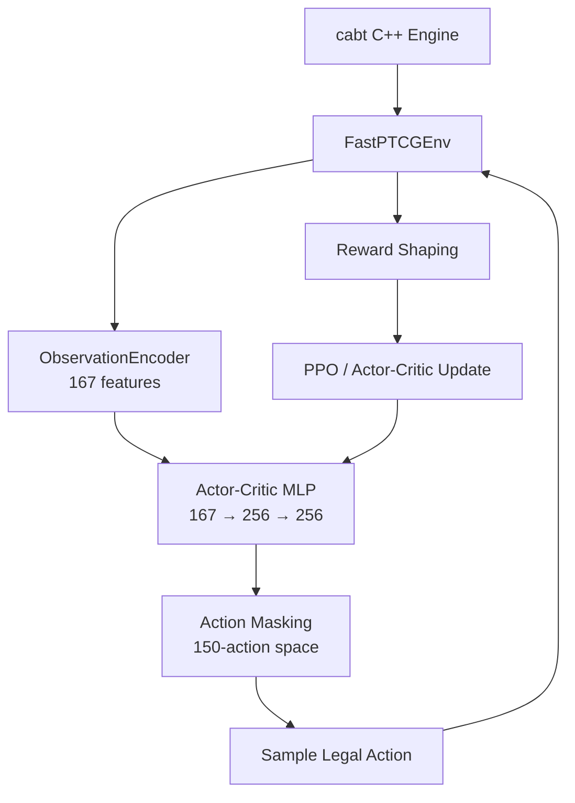

<h1 align="center">PTCG AI Battle Agent</h1>

<p align="center">
  <strong>End-to-end Pokémon TCG game-playing agent combining simulation, reinforcement learning, heuristic planning, replay analysis, and evolutionary policy tuning.</strong>
</p>

<p align="center">
  
</p>

<p align="center">
  <a href="https://www.kaggle.com/competitions/pokemon-tcg-ai-battle"></a>
  <a href="https://matsuoinstitute.github.io/cabt/"></a>
  <a href="https://pytorch.org/"></a>
  <a href="https://gymnasium.farama.org/"></a>
</p>

<p align="center">
  
  
  
  
</p>

---

## Overview

This repository contains an experimental AI agent for the **Kaggle Pokémon TCG AI Battle Challenge**.

The project started as a reinforcement-learning system and evolved into a broader game-playing framework after benchmarking several approaches against the real competition ladder. The final system combines **domain-specific heuristics, replay-driven debugging, search/decision experiments, and automated policy tuning**, while retaining the RL and simulation infrastructure used during earlier phases.

The current best recorded result is **958.8 ladder score with the Mega Lucario heuristic agent (v19)**. The RL branch reached a best recorded score of **342.0**, which motivated the shift toward domain-aware planning and replay-based optimization.

The key idea is simple:

> **Build the simulator, learn what works, measure it on the real environment, inspect failures, and turn those failures into better decision rules.**

---

## What the System Does

At a high level, the project converts a live Pokémon TCG game state into a legal, strategically ranked action:

```text
┌──────────────────────┐
│   Pokémon TCG Game   │
│     cabt Engine      │
└──────────┬───────────┘
           │ Observation
           ▼
┌──────────────────────┐
│ State / Context      │
│ Encoding & Tracking  │
└──────────┬───────────┘
           │
           ▼
┌────────────────────────────────────────────┐
│              Decision Layer                │
│                                            │
│  PPO / Neural Policy   Heuristic Policy    │
│  MCTS / Hybrid Tests   Replay-derived Rules│
└────────────────────┬───────────────────────┘
                     │ Candidate actions
                     ▼
             ┌───────────────┐
             │ Action Masking│
             │ + Safety      │
             └───────┬───────┘
                     │ Legal action
                     ▼
              ┌────────────┐
              │ cabt Engine│
              └─────┬──────┘
                    │
                    ▼
                 New State
                    │
                    └──────────────► Evaluation / Replay
                                          │
                                          ▼
                                    Policy Improvement
```

The architecture is deliberately modular. The game engine, environment, state representation, policy, action validation, evaluation, and replay analysis can be developed independently.

---

## Architecture

### 1. Game Simulation Layer

The project uses the **cabt C++ Pokémon TCG engine** as the game simulator. `FastPTCGEnv` wraps the engine with a Gymnasium-compatible interface so that agents can interact with the game using the familiar `reset()` / `step()` loop.

```text
Agent action
     │
     ▼
FastPTCGEnv
     │
     ▼
cabt C++ engine
     │
     ├── game state
     ├── legal selections
     ├── game result
     └── opponent turn
             │
             ▼
      opponent policy
             │
             └── repeat until RL agent's turn
```

The environment also fast-forwards opponent turns. This keeps the learning loop focused on the decisions controlled by the agent rather than wasting training steps on environment-controlled actions.

**Key file:** `src/env/fast_sim.py`

---

### 2. State Representation

The raw engine observation is a nested, variable-length game-state structure. The project contains an `ObservationEncoder` that converts this state into a numerical representation suitable for neural policies.

The current PPO training pipeline uses a **167-dimensional state representation**.

The encoded state captures information such as:

- Active and benched Pokémon
- HP and maximum HP
- Attached energy
- Hand / deck / discard information
- Prize state
- Turn and step information
- Visible opponent state
- Current selection context

The repository also contains opponent-state tracking and more structured card/context representations used by the heuristic and hybrid agents.

**Key files:**

- `src/agent/state_encoder.py`
- `src/agent/opponent_model.py`

---

### 3. Action Space and Legal-Action Masking

Pokémon TCG has a large and highly context-dependent action space. The same action index can be legal in one state and invalid in another.

The project therefore uses a fixed maximum action space and masks actions that are not currently legal.

```text
Raw policy logits
       │
       ▼
┌──────────────────┐
│ Legal action mask │
│ 1 = legal         │
│ 0 = illegal       │
└────────┬─────────┘
         ▼
Masked logits
         │
         ▼
Selected action
```

This is critical for both RL training and competition stability because an illegal engine call can terminate a submission.

**Key file:** `src/agent/action_mask.py`

---

## Reinforcement Learning Pipeline

One major branch of the project explored PPO-based learning from simulated games.



### Parallel Training

The training pipeline can run multiple independent environments in parallel. Worker processes own their environments while the main process batches observations and performs neural-network inference.

The Phase 3 trainer uses **10 parallel workers** and was designed for long-running training runs of up to hundreds of thousands of episodes.

**Key file:** `src/train/train_ppo_parallel.py`

### Reward Shaping

The reward function combines terminal outcomes with intermediate game-state signals:

- `+1.0` for a win
- `-1.0` for a loss
- Small penalty for a draw
- Positive reward for taking Prize cards
- Negative reward when the opponent takes Prizes
- Board-utility shaping based on HP and energy
- Deck-preservation pressure in low-deck situations
- Additional penalties/rewards for bench-out and deck-out outcomes

**Key file:** `src/env/reward.py`

### RL Result

The best recorded RL submission reached **342.0** on the competition ladder. This became an important benchmark: increasing RL complexity did not automatically translate into stronger competition performance.

That result directly motivated the project pivot toward domain-specific decision making.

---

## Heuristic Planning: Mega Lucario

The strongest agent in the repository is currently the **Mega Lucario rule-based policy**.

Instead of asking a neural network to learn every tactical interaction from scratch, the policy explicitly scores actions using game-state and card-context features.

Conceptually:

```text
                    Current Game State
                           │
                           ▼
                  Generate legal actions
                           │
                           ▼
              ┌─────────────────────────┐
              │ Action scoring function │
              │                         │
              │ Pokémon setup           │
              │ Evolution               │
              │ Abilities               │
              │ Energy attachment       │
              │ Trainer usage           │
              │ Switching               │
              │ Boss's Orders           │
              │ Attacks                 │
              │ Deck / prize context    │
              └────────────┬────────────┘
                           │
                           ▼
                    Ranked legal actions
                           │
                           ▼
                       Best action
```

The policy contains specialized logic for tactical situations including setup, energy management, evolution, attacks, switching, Boss's Orders targeting, Hero Cape usage, deck preservation, and bench management.

**Key file:** `src/agent/rule_based_lucario.py`

---

## Replay-Driven Improvement

One of the most important parts of the project is the evaluation loop.

Rather than tuning the agent only from local simulations, real Kaggle games are treated as debugging data:

```text
Kaggle Submission
       │
       ▼
   Real Matches
       │
       ▼
     Replays
       │
       ▼
Replay Parsing / Analysis
       │
       ▼
Identify repeated misplays
       │
       ▼
Patch decision logic
       │
       ▼
New submission
       │
       └──────────────► Ladder score
                              │
                              └──► repeat
```

The replay tooling was used to identify tactical failures and turn them into concrete policy changes. Notable examples included attack timing, Boss's Orders target selection, Hero Cape usage, prize-trail logic, and deck-search behavior.

**Key files:**

- `src/train/download_replays.py`
- `src/train/parse_replays.py`
- `src/train/analyze_replays.py`
- `src/train/analyze_replays_v2.py`
- `src/train/replay_debugger.py`

---

## Evolutionary Policy Tuning

The heuristic policy exposes many action-priority weights. The repository also includes tooling to mutate and evaluate these values rather than relying exclusively on manual tuning.

```text
Initial policy weights
        │
        ▼
     Mutation
        │
        ▼
  Run evaluation
        │
        ▼
Keep / reject candidate
        │
        └──────────► repeat
```

This turns the heuristic policy into a tunable parameterized decision function and provides a lightweight black-box optimization layer around the domain knowledge.

**Key files:**

- `src/agent/lucario_w.json`
- `src/train/evolve_lucario.py`

---

## Hybrid & Search Experiments

The project also contains experiments beyond vanilla PPO and hand-written heuristics, including a Transformer-based policy and MCTS-style search.

The hybrid architecture explores:

```text
Structured game state
        │
        ▼
Card / state embeddings
        │
        ▼
Transformer encoder
        │
        ├──────────────► Value estimate
        │
        ▼
Action / decoder representation
        │
        ▼
Policy scores
        │
        ▼
Search / action selection
```

These experiments are retained because they form part of the research path toward combining learned representations with domain-specific planning.

**Key file:** `src/agent/hybrid_lucario.py`

---

## Competition Results

The project followed a phase-gated workflow: new strategies were promoted only after being tested against the real competition environment.

| Stage | Result | Outcome |
|---|---:|---|
| Initial rule-based baseline | **170.1** | Working baseline |
| RL / PPO pipeline | **303.6** | Major improvement over initial baseline |
| Best RL submission | **342.0** | RL plateau / pivot point |
| Mega Lucario heuristic | **615.4** | Large improvement from domain specialization |
| Improved Lucario policy | **775.5** | Better tactical decision making |
| Replay-patched policy | **902.4** | Major tactical improvements |
| Replay-patched peak | **936.0** | Best score during that iteration |
| **Lucario v19** | **958.8** | **Current best recorded score** |
| Lucario v20 | Pending | Deck-search / low-deck behavior hotfix |

See [`eval/ladder_log.md`](eval/ladder_log.md) for the complete experiment history.

---

## Why the RL Approach Was Not the Final Winner

The project is intentionally not presented as a story where “more neural network = better agent.”

The experiments showed that the competition environment rewards **precise tactical execution, legal-action reliability, and deck-specific planning**. The PPO policy reached 342.0, while a carefully engineered Mega Lucario policy eventually reached 958.8.

That comparison led to the current architecture:

```text
RL / Neural methods
       │
       ├── useful for representation learning
       ├── useful for policy experiments
       └── useful for future generalization

Domain heuristics
       │
       ├── strong tactical priors
       ├── predictable behavior
       └── easy debugging

Replay analysis
       │
       └── converts real failures into targeted fixes

Evolutionary tuning
       │
       └── searches the heuristic parameter space

              ↓

        Strong competition agent
```

The result is less about choosing one AI technique and more about building an **empirical decision-making system** around the constraints of the actual game and deployment environment.

---

## Project Structure

```text
ptcg-rl-agent/
├── main.py                         # Competition entrypoint
├── deck.csv                        # Active competition deck
├── requirements.txt
│
├── src/
│   ├── agent/
│   │   ├── action_mask.py          # Legal-action masking
│   │   ├── state_encoder.py        # Observation → vector encoding
│   │   ├── opponent_model.py       # Opponent-state tracking
│   │   ├── policy.py               # NumPy neural-policy inference
│   │   ├── rule_based_lucario.py   # Main Mega Lucario heuristic
│   │   └── hybrid_lucario.py       # Transformer / hybrid experiments
│   │
│   ├── env/
│   │   ├── fast_sim.py             # Gymnasium + cabt wrapper
│   │   └── reward.py                # Reward shaping
│   │
│   └── train/
│       ├── train_ppo.py            # PPO training
│       ├── train_ppo_parallel.py   # Parallel PPO training
│       ├── parse_replays.py        # Replay processing
│       ├── analyze_replays.py      # Replay analysis
│       ├── replay_debugger.py      # Tactical debugging
│       └── evolve_lucario.py       # Policy-weight optimization
│
├── eval/
│   └── ladder_log.md               # Submission and ladder history
│
├── tests/                          # Unit / component tests
├── decks/                          # Deck analysis and rationale
└── models/                         # Trained model artifacts
```

---

## Deployment Pipeline

The project separates **training** from **competition inference**.

```text
LOCAL DEVELOPMENT

cabt simulator
      │
      ▼
PyTorch / RL training
      │
      ├── checkpoints
      └── NumPy weight export

              ↓

KAGGLE DEPLOYMENT

main.py
   │
   ├── deck.csv
   ├── heuristic policy
   └── optional NumPy neural policy
             │
             ▼
        cabt engine
             │
             ▼
        Legal action
```

For neural inference, PyTorch weights can be exported to `.npz` and evaluated using NumPy. This keeps the competition runtime lightweight and avoids requiring the training framework during deployment.

---

## Local Setup

### Requirements

- Python 3.12
- PyTorch for RL training
- NumPy
- Gymnasium
- Access to the `cabt` competition engine / competition files
- CUDA is recommended for neural-network training but is not required for heuristic inference

### Install

```bash
python -m venv .venv

# Windows
.venv\Scripts\activate

# Linux / macOS
source .venv/bin/activate

pip install -r requirements.txt
```

### Run the Agent

```bash
python main.py
```

### Train PPO

```bash
python src/train/train_ppo.py
```

For the parallel trainer:

```bash
python src/train/train_ppo_parallel.py
```

### Run Tests

```bash
pytest
```

> Exact competition packaging and engine setup depend on the Kaggle environment and the competition's supplied files. See the repository's training scripts and `AGENTS.md` for environment-specific details.

---

## Lessons From the Experiment

### 1. More complex RL does not guarantee a better game agent

The best RL result plateaued far below the strongest domain-specific policy.

### 2. Action legality is part of intelligence in a constrained environment

A theoretically strong policy is useless if it repeatedly emits invalid actions or crashes the engine.

### 3. Real-game replays are valuable training data even without supervised learning

A replay can reveal *why* an agent made a bad decision and point directly to a missing rule or feature.

### 4. Domain knowledge can dramatically reduce the search space

The Mega Lucario policy does not need to rediscover every obvious Pokémon TCG interaction through millions of games.

### 5. Evaluation should drive architecture decisions

The project moved from PPO → hybrid experiments → heuristic planning because the measured competition results demanded it.

---

## Future Work

- Implement canonical clipped PPO with proper rollout buffers and multi-step advantage estimation.
- Build a unified learned-policy + heuristic-policy action-ranking system.
- Add MCTS over the strongest heuristic policy rather than searching from a weak generic policy.
- Improve entity-aware card/state embeddings with attention.
- Train against a broader opponent population and multiple decks.
- Build reproducible local evaluation with confidence intervals and large match batches.
- Add automated replay-to-regression tests so known tactical mistakes cannot reappear.
- Continue optimizing the Mega Lucario policy beyond the current 958.8 benchmark.

---

## References

- [cabt Engine Documentation](https://matsuoinstitute.github.io/cabt/)
- [Kaggle Pokémon TCG AI Battle](https://www.kaggle.com/competitions/pokemon-tcg-ai-battle)
- [Ladder Experiment Log](eval/ladder_log.md)
- [Agent Guidelines](AGENTS.md)
- [Deck Rationale](decks/deck_rationale.md)

---

## License

Competition-specific code and assets are subject to the applicable competition rules and terms. See the competition documentation before redistributing engine files, datasets, or submission artifacts.
