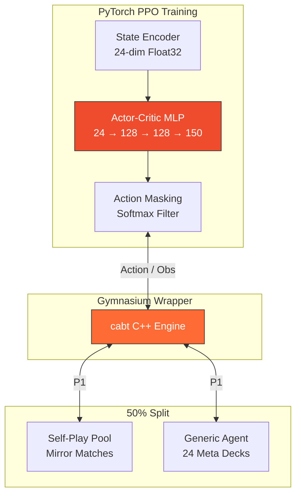
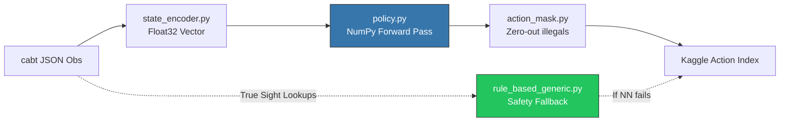

<h1 align="center">
PTCG AI Battle Agent</h1>

<p align="center">
  <strong>Reinforcement Learning + Heuristic Agent for the Kaggle Pokémon TCG AI Battle Challenge</strong>
</p>

<p align="center">
  <a href="https://www.kaggle.com/competitions/pokemon-tcg-ai-battle">
    
  </a>
  <a href="https://matsuoinstitute.github.io/cabt/">
    
  </a>
  <a href="https://pytorch.org/">
    
  </a>
  <a href="https://gymnasium.farama.org/">
    
  </a>
  
  
</p>

<p align="center">
  
  
  
  
  
</p>

---

## Overview

A competitive **PPO Reinforcement Learning** agent for the Kaggle Pokémon TCG AI Battle Challenge. The agent is trained locally using PyTorch with CUDA acceleration and deployed to Kaggle using a pure-NumPy inference pipeline for maximum runtime compatibility.

The project follows a strict **phase-gated deployment cycle**: every new agent iteration must empirically outperform the previous production version on the real Kaggle ladder before being promoted to the `main.py` entrypoint.

| Metric | Value |
|---|---|
| Best Ladder Score | **303.6** (Phase 2 RL) |
| Submission Format | `submission.tar.gz` (main.py + deck.csv + src + models) |
| Time Budget | 600s per match |
| Deck Configuration | Mono-Water Basic (60 cards) |
| Policy Architecture | PPO Actor-Critic (MLP 24→128→128→150) |
| Training Hardware | AMD Ryzen 5 5600H + RTX 3050 (CUDA) |

---

## Project Structure

```
ptcg-rl-agent/
├── main.py                  # Thin Kaggle entrypoint (loads policy_agent)
├── deck.csv                 # 60-card deck submitted with the agent
├── src/
│   ├── agent/
│   │   ├── rule_based.py         # Phase 1: Heuristic rule-based agent
│   │   ├── rule_based_generic.py # Universal "True Sight" opponent for all 24 meta decks
│   │   ├── policy.py             # Phase 2: Pure-NumPy RL policy inference
│   │   ├── state_encoder.py      # Encodes cabt JSON obs → flat float32 vector
│   │   ├── action_mask.py        # Masks illegal actions from logits (NumPy)
│   │   └── opponent_model.py     # Probabilistic opponent hand/deck tracker
│   ├── env/
│   │   ├── fast_sim.py         # Gymnasium wrapper around the C++ cg engine
│   │   └── reward.py           # Shaped reward (win/loss + prizes + KOs)
│   └── train/
│       ├── train_ppo.py        # PPO training loop (PyTorch + CUDA)
│       └── self_play.py        # Checkpoint pool for self-play training
├── models/
│   ├── ppo_baseline.pth        # PyTorch checkpoint (local training only)
│   └── ppo_weights.npz         # NumPy exported weights (Kaggle inference)
├── assets/
│   └── banner.png              # Project banner
├── decks/                   # Deck rationale and meta configurations
├── eval/
│   ├── ladder_log.md           # Real ladder submission log
│   └── local_vs_ladder.md      # Local sim vs. ladder comparison
└── scripts/                 # Build, validate, and submission helpers
```

---

## Setup and Installation

### 1. Virtual Environment Initialization

```bash
python -m venv .venv
.venv\Scripts\activate        # Windows
pip install -r requirements.txt
```

### 2. Dataset Acquisition

Authenticate with Kaggle (`~/.kaggle/kaggle.json`), then download the card dataset:

```bash
python -c "import kagglehub; kagglehub.competition_download('pokemon-tcg-ai-battle-challenge-strategy')"
```

Place `EN_Card_Data.csv` in the `data/` folder.

---

## Usage

### Run a Local Test Match

```bash
.venv\Scripts\python tests\test_agent.py
```

Executes a full match between `policy_agent` (Player 0) and `rule_based_agent` (Player 1) using the local C++ simulation engine.

### Train the PPO Model

```bash
.venv\Scripts\python src\train\train_ppo.py
```

Initiates the PyTorch training loop on CUDA. Saves weights to `models/ppo_baseline.pth` and `models/ppo_weights.npz`.

### Build and Submit to Kaggle

```bash
tar -czvf submission.tar.gz main.py deck.csv src models
kaggle competitions submit -c pokemon-tcg-ai-battle -f submission.tar.gz -m "your message"
```

> **Note on Rate Limits:** The Kaggle API enforces a strict daily limit of 5 submissions. Always validate the agent locally before submission.

---

## Phase Status and Ladder Results

| Phase | Status | Real Ladder Score | Notes |
|---|---|---|---|
| **Phase 0** — Deck Selection | Complete | — | Mono-Water: 4x Squirtle, 4x Staryu, 4x Poliwag, 48x Water Energy |
| **Phase 1** — Rule-Based Agent | Complete | **170.1** | Heuristic: Attack > Evolve > Play > Attach > End |
| **Phase 2** — RL Pipeline | Deployed | **303.6** | PPO + Pure-NumPy inference. Current active deployment. |
| **Phase 4** — Bellibolt Heuristic | Complete | **157.6** | Rule-based agent with Iono's Bellibolt deck. |
| **Phase 9** — RL Agent (BC Init) | Complete | **282.3** | PPO initialized from Behavioral Cloning on Lopunny deck. |
| **Current** — Meta Opponent Curriculum | In Progress | Target: **>303.6** | PPO trained against all meta decks to generalize strategy. |

Full submission history → [`eval/ladder_log.md`](eval/ladder_log.md)

---

## System Architecture

### 1. Training Curriculum (Local PyTorch)

To ensure the agent generalizes against the entire tier-1 meta without forgetting how to pilot its own deck, training utilizes a **50/50 Hybrid Curriculum**:



- **Self-Play Pool:** Prevents strategy collapse. The agent learns the fundamental mechanics (shadowboxing) by playing against past checkpoints of itself.
- **Generic Meta Agent:** The `rule_based_generic.py` agent acts as the ultimate gatekeeper, utilizing "True Sight" (database lookups) to pilot 24 highly-optimized, tier-1 meta decks flawlessly.

### 2. Inference Pipeline (Kaggle Deployment)

> **Environment Context**: The `cabt` environment is built `FROM gcr.io/kaggle-images/python:v163` — the full Kaggle Python image. **PyTorch IS available** at the Kaggle runtime. However, we utilize **pure NumPy inference** to ensure an ultra-fast cold-start and to avoid memory fragmentation over the 10-minute game limit.



### RL Pipeline Components

| Component | File | Description |
|---|---|---|
| Environment | `src/env/fast_sim.py` | Gymnasium wrapper; RL agent is P0, rule-based auto-drives P1 |
| State Encoder | `src/agent/state_encoder.py` | 24-dim: 4 global + 10 self + 10 opponent |
| Action Mask | `src/agent/action_mask.py` | NumPy masked softmax over variable-length legal moves |
| Reward | `src/env/reward.py` | Shaped: win/loss terminal + prize delta per step |
| Actor-Critic | `src/train/train_ppo.py` | MLP(24→128→128→150), 1-step TD PPO |
| Policy (Kaggle) | `src/agent/policy.py` | Pure NumPy forward pass; loads `ppo_weights.npz` |

### Known Limitations & Phase 3 Roadmap

| Limitation | Phase 3 Solution |
|---|---|
| 24-dim state (no HP, type, moves) | Expand to ~128-dim encoder |
| Only 50 training episodes | **Complete:** 100k+ episodes with 9-worker parallel envs |
| No self-play | **Complete:** Hybrid Checkpoint pool + Meta Decks |
| Weak mono-basic deck | **Complete:** Snorlax/Lopunny control deck |

---

## Key Development Rules

- **Execution Safety** — The agent must never crash. It must always return a legal fallback action. Crashes result in an instant loss.
- **Turn 0 Initialization** — Turn 0 must always return the deck configuration (60 card IDs). All subsequent turns return action indices.
- **Deployment Protocol** — Never promote a Phase N+1 agent to `main.py` unless it empirically beats the previous agent's real ladder score.
- **Ladder Authority** — Local simulations differ from the real ladder. Local results are sanity checks only; the real ladder is the sole source of ground truth.

---

## References

- [cabt Engine Documentation](https://matsuoinstitute.github.io/cabt/)
- [Kaggle Competition Page](https://www.kaggle.com/competitions/pokemon-tcg-ai-battle)
- [Ladder Log](eval/ladder_log.md) · [AGENTS.md](AGENTS.md) · [Deck Rationale](decks/deck_rationale.md)
