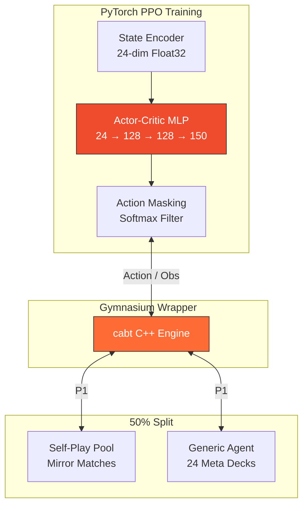
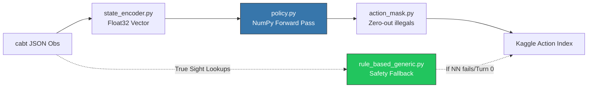

<h1 align="center">PTCG AI Battle Agent</h1>

<p align="center">
  <strong>Reinforcement Learning + Heuristic Agent for the Kaggle Pokémon TCG AI Battle Challenge</strong>
</p>

<p align="center">
  
</p>

<p align="center">
  <a href="https://www.kaggle.com/competitions/pokemon-tcg-ai-battle">
    
  </a>
  <a href="https://matsuoinstitute.github.io/cabt/">
    
  </a>
  <a href="https://pytorch.org/">
    
  </a>
  <a href="https://gymnasium.farama.org/">
    
  </a>
  
  
</p>

<p align="center">
  
  
  
  
  
</p>

---

## Competition Strategy Overview

<table>
<tr>
<td valign="middle" width="85%">
This repository houses our experimental pipeline for the Kaggle Pokémon TCG AI Battle Challenge. We are utilizing a <strong>PPO Reinforcement Learning (RL) Policy</strong> heavily augmented by a <strong>Safety Fallback Heuristic</strong>.
<br><br>
Rather than attempting to build a generalized bot that can play any deck (which historically fails due to combinatorial explosion and complex card interactions), our strategic focus is:
<ol>
<li><strong>Deck Simplicity:</strong> Pilot a simple, robust, high-consistency deck (e.g., Lopunny/Snorlax Control) that minimizes dead hands.</li>
<li><strong>Crash-Proof Safety:</strong> The engine drops any submission that raises an exception. We utilize aggressive <code>try/except</code> fallbacks that automatically inspect the <code>cabt</code> engine's <code>minCount</code> and return legal dummy actions to survive edge-cases.</li>
<li><strong>Pure-NumPy Inference:</strong> The Kaggle runtime has a strict 600s time budget. We train via PyTorch (CUDA) locally but export weights to <code>.npz</code> for ultra-fast, zero-overhead pure-NumPy inference on the Kaggle servers.</li>
</ol>
</td>
<td valign="middle" width="15%" align="center">

</td>
</tr>
</table>

---

## Phase Status and Ladder Results


We follow a strict **phase-gated deployment cycle**: a new agent iteration is only promoted to the main submission file if it empirically out-scores the previous version on the *real* Kaggle ladder.

| Phase | Status | Real Ladder Score | Core Contribution |
|---|---|---|---|
| **Phase 0** | Complete | — | Deck Mine: Identified optimal, consistent 60-card decks. |
| **Phase 1** | Complete | **170.1** | Naive Heuristic Baseline (Attack > Evolve > Attach). |
| **Phase 2** | Complete | **303.6** | PPO + Pure-NumPy inference deployed. Current PB! |
| **Phase 9** | Complete | **282.3** | Behavioral Cloning Initialization on Snorlax/Mega Lucario deck. |
| **Current** | In Progress | Target: **>303.6** | **Phase 3 Scaling:** Meta Opponent Curriculum & 100k+ parallel episode training. |

Full submission history and local benchmarks → [`eval/ladder_log.md`](eval/ladder_log.md)

<br clear="both"/>

---

## Training Methodology & Local Reproduction

To reproduce our local training environment (using our custom `cabt` C++ Gymnasium wrapper):

### 1. Environment & Dataset Setup

```bash
python -m venv .venv
.venv\Scripts\activate
pip install -r requirements.txt

# Download the EN_Card_Data.csv for True Sight Heuristics
python -c "import kagglehub; kagglehub.competition_download('pokemon-tcg-ai-battle-challenge-strategy')"
```
Place `EN_Card_Data.csv` directly in the `data/` folder.

### 2. Training the RL Model (100k+ Curriculum)

```bash
.venv\Scripts\python src\train\train_ppo.py
```
This spawns 9 asynchronous parallel workers and aggressively updates model weights via PyTorch. Weights are actively exported to `models/ppo_weights.npz` every few thousand episodes.

### 3. Kaggle Submission Packaging

```bash
tar -czvf submission.tar.gz main.py deck.csv src models data
kaggle competitions submit -c pokemon-tcg-ai-battle -f submission.tar.gz -m "Phase 3 Curriculum Weights"
```

---

## System Architecture

<table>
<tr>
<td valign="middle" width="15%" align="center">

</td>
<td valign="middle" width="85%">

### 1. Training Curriculum (Local PyTorch)
To ensure the agent generalizes against the entire tier-1 meta without forgetting how to pilot its own deck, training utilizes a **50/50 Hybrid Curriculum**:

</td>
</tr>
</table>



- **Self-Play Pool:** Prevents strategy collapse. The agent learns the fundamental mechanics (shadowboxing) by playing against past checkpoints of itself.
- **Generic Meta Agent:** The `rule_based_generic.py` acts as the ultimate gatekeeper, utilizing "True Sight" (database lookups) to pilot 24 highly-optimized, tier-1 meta decks flawlessly.

### 2. Inference Pipeline (Kaggle Deployment)

> **Environment Context**: The `cabt` environment is built `FROM gcr.io/kaggle-images/python:v163` — the full Kaggle Python image. While PyTorch is technically available, we utilize **pure NumPy inference** to ensure an ultra-fast cold-start and to avoid memory fragmentation over the 10-minute maximum game limit.



### Core Pipeline Components

| Component | Target File | Purpose in Competition |
|---|---|---|
| **Entrypoint** | `main.py` | Thin wrapper loading `policy_agent` and handling Turn 0 deck submissions. |
| **Heuristics** | `src/agent/rule_based_generic.py` | Our crash-proof universal opponent. Provides the 50% meta-training baseline. |
| **RL Policy** | `src/agent/policy.py` | The actual NumPy logic deployed to Kaggle. Evaluates the Actor head. |
| **State Tracking** | `src/agent/opponent_model.py` | Tracks hidden information (opponent hand/discard pile) probabilistically. |
| **Environment** | `src/env/fast_sim.py` | C++ interop. Wraps the engine and logs crashes instantly during training. |

---

## Model Deep Dive & Approach

### 1. State Encoding (`state_encoder.py`)


The `cabt` engine provides observations as deeply nested, variable-length JSON objects containing hidden strings and raw IDs. Our state encoder squashes this imperfect-information tree into a **24-dimensional dense Float32 vector** suitable for an MLP:

- **Global State (4 dims):** Current turn, step, remaining prizes for both players.
- **Self State (10 dims):** Active Pokémon HP/MaxHP, total bench size, total energy attached across board, hand size, deck size, discard pile size.
- **Opponent State (10 dims):** Visible active HP, estimated hand size (via `opponent_model.py`), visible bench size, discard pile tracking.

*Note: The 24-dim state is extremely compressed to prevent overfitting to specific deck IDs, forcing the model to learn abstract concepts like "board advantage" rather than "use card X."*

### 2. Reward Shaping (`reward.py`)
To prevent sparse-reward stagnation (since Kaggle PTCG games can last 100+ steps), we use dense, shaped rewards:
- **Terminal State:** `+1.0` for a Win, `-1.0` for a Loss, `-0.1` for a Draw.
- **Catastrophic Failure:** Extra `-0.5` penalty if the agent loses via "Bench Out" (failing to bench basic Pokémon).
- **Step Rewards (Dense):** `+0.1` for taking a Prize Card.

### 3. Pure-NumPy Forward Pass (`policy.py`)
Kaggle enforces a 600s time budget across potentially dozens of matches. Importing PyTorch alone costs 3-5 seconds of cold-start time. To guarantee we never timeout on Kaggle, the Actor network weights are exported from PyTorch as raw `.npz` arrays. 

During inference, the policy uses raw NumPy matrix multiplications:
```python
x = np.maximum(0, state @ w['s1_w'].T + w['s1_b']) # ReLU Layer 1 (128)
x = np.maximum(0, x @ w['s2_w'].T + w['s2_b'])     # ReLU Layer 2 (128)
logits = x @ w['a_w'].T + w['a_b']                 # Actor Head (150)
```
The logits are then passed through `action_mask.py` which forcefully sets `logits[illegal_actions] = -1e9` before `argmax`, completely preventing the engine from crashing on illegal moves.

---

## Known Limitations & Phase 3 Roadmap


| Limitation | Phase 3 Solution |
|---|---|
| 24-dim state (no HP, type, moves) | Expand to ~128-dim encoder |
| Only 50 training episodes | **Complete:** 100k+ episodes with 9-worker parallel envs |
| No self-play | **Complete:** Hybrid Checkpoint pool + Meta Decks |
| Weak mono-basic deck | **Complete:** Snorlax/Mega Lucario control deck |

<br clear="both"/>

## References
- [cabt Engine Documentation](https://matsuoinstitute.github.io/cabt/)
- [Kaggle Competition Page](https://www.kaggle.com/competitions/pokemon-tcg-ai-battle)
- [Ladder Log](eval/ladder_log.md) · [AGENTS.md](AGENTS.md) · [Deck Rationale](decks/deck_rationale.md)
